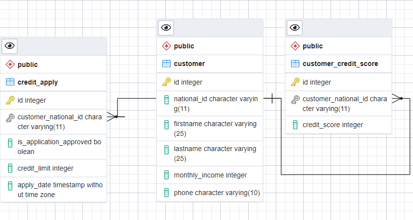

# Credit System API 

SpringBoot Application REST API Development using Spring Boot, Spring Data JPA using Java 8 features.
## Features

This application has two controllers.
1. CustomerController
2. CreditApplicationController

REST end-point that provides credit-application information.
* GET /creditApplication//by-customer/{nationalId}

REST end-point that provides creating credit-application :
* POST /creditApplication/applyForCredit

REST end-points that provides CREATE,UPDATE,DELETE operations for customer :
1. POST /customer/create
2. PUT /customer/update
3. DELETE /customer/delete

##Database Design Architecture


## Technologies used

1. Java (Programming Language)
2. Spring Boot (Application Platform)
3. Spring Data JPA (Data persistence)
4. Hibernate
5. PostgreSQL
6. Swagger
7. JUnit, Mockito (Unit Testing)
8. Docker
9. RabbitMQ

## Getting Started

The source code can be checked out to your local and then build and run the application either from your IDE after importing to it as a maven project, or just from a command line. Follow these steps for the command-line option:  

### Prerequisites
1. Java 8
2. Maven 3
3. Git
4. PostgreSQL


### Installing & Running

#### Clone this repo into your local: 
	
```
git clone https://github.com/aleynazengin/paycore-credit-system-project.git
```

####  Build using maven 
	
```
mvn clean install
```
	
#### Start the app
	
```
mvn spring-boot:run
```
	
#### Access the Home screen

The application will be available at the URL: [Home](http://localhost:8080).

##RabbitMQ
Exposing the Costumer as a service to be used by another micro-service. [RabbitMQ Consumer Project](https://github.com/aleynazengin/paycore-simple-rabbitmq-consumer).

Start rabbitmq-server after installing it on your machine

Username/password: guest/guest

RabbitMQ will be available at the URL: [RabbitMQ](http://localhost:5672).

##Docker
First you need to uncomment this line in application.properties;

* spring.profiles.active=docker

Start Docker Engine in your machine.

Run mvn clean install.

Build executable jar file - mvn clean package

Build Docker image - docker build -t paycore-credit-system-project-app:v1 .

Run Docker container using the image built - docker run -p 8085:8085 paycore-credit-system-project-app:v1
    
## API Documentation

API documentation can be accessed via [Swagger UI](http://localhost:8080/swagger-ui.html) 

## Architectural Approach
This application developed using Monolithic Approach.
When your application doesn’t require advanced scalability and the complexity is manageable, then a monolith architecture is the best road to go down.

Monoliths have the following advantages:
1. Monoliths are easier for development so they are faster to develop.
2. You can easily control monoliths.
3. Testing monoliths is easy.

## Running the Test Cases

Test cases for this project:

[CustomerControllerTest.java](src/test/java/com/patika/paycorecreditsystemproject/controller/CustomerControllerTest.java)

[CustomerServiceImplTest.java](src/test/java/com/patika/paycorecreditsystemproject/service/impl/CustomerServiceImplTest.java)

[CreditApplicationImplTest.java](src/test/java/com/patika/paycorecreditsystemproject/service/impl/CreditApplicationImplTest.java)

You can run it either from:

- Command line

```
mvn test
```

- Your IDE


	Right click on this file and "Run As JUnit Testcase"  

